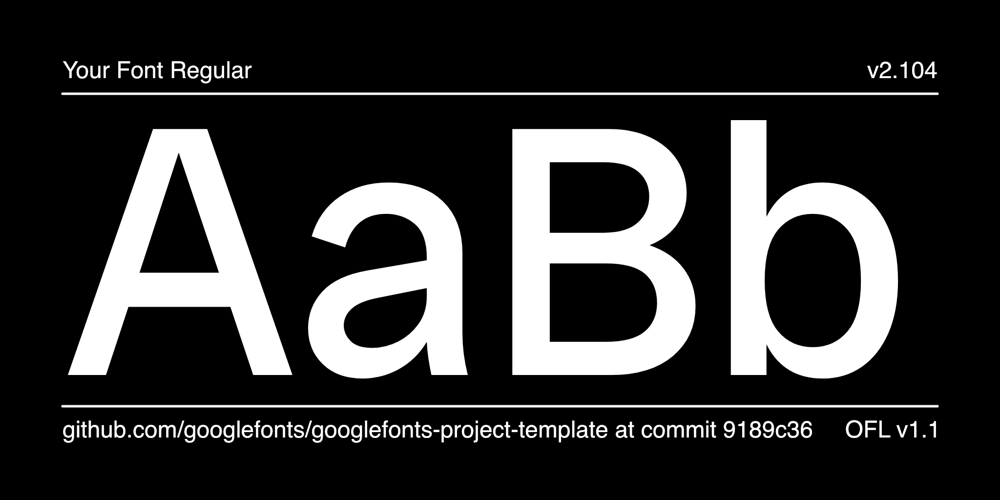
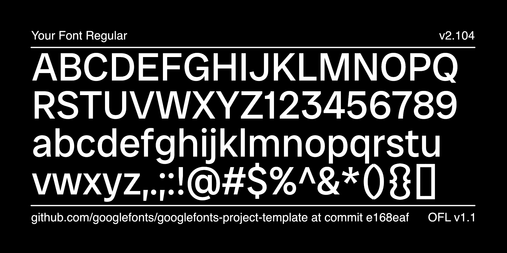

# Hydorus Neue

[![][Fontspector]](https://googlefonts.github.io/googlefonts-project-template/fontspector/fontspector-report.html)
[![][OpenType]](https://googlefonts.github.io/googlefonts-project-template/fontspector/fontspector-report.html)
[![][Universal]](https://googlefonts.github.io/googlefonts-project-template/fontspector/fontspector-report.html)
[![][Google Fonts]](https://googlefonts.github.io/googlefonts-project-template/fontspector/fontspector-report.html)
[![][Glyphset]](https://googlefonts.github.io/googlefonts-project-template/fontspector/fontspector-report.html)

[Fontspector]: https://img.shields.io/endpoint?url=https%3A%2F%2Fgooglefonts.github.io%2Fgooglefonts-project-template%2Fbadges%2FFontspectorQA.json
[OpenType]: https://img.shields.io/endpoint?url=https%3A%2F%2Fgooglefonts.github.io%2Fgooglefonts-project-template%2Fbadges%2FOpentypeSpecificationChecks.json
[Universal]: https://img.shields.io/endpoint?url=https%3A%2F%2Fgooglefonts.github.io%2Fgooglefonts-project-template%2Fbadges%2FUniversalProfileChecks.json
[Google Fonts]: https://img.shields.io/endpoint?url=https%3A%2F%2Fgooglefonts.github.io%2Fgooglefonts-project-template%2Fbadges%2FFontFileChecks.json
[Outline Correctness]: https://img.shields.io/endpoint?url=https%3A%2F%2Fgooglefonts.github.io%2Fgooglefonts-project-template%2Fbadges%2FOutlineCorrectnessChecks.json
[Glyphset]: https://img.shields.io/endpoint?url=https%3A%2F%2Fgooglefonts.github.io%2Fgooglefonts-project-template%2Fbadges%2FGlyphsetChecks.json

## About

Hydorus Neue is a universal-designed font.

## Building

Fonts are built automatically by GitHub Actions — take a look in the "Actions" tab for the latest build.

If you want to build fonts manually on your own computer:

- `make build` will produce font files.
- `make test` will run [Fontspector](https://fonttools.github.io/fontspector/)'s quality assurance tests.
- `make proof` will generate HTML proof files.

The proof files and QA tests are also available automatically via GitHub Actions — look at `https://yourname.github.io/your-font-repository-name`.

## Changelog

- No

**05.29.2026**

- Initial

## License

This Font Software is licensed under the SIL Open Font License, Version 1.1.
This license is available with a FAQ at https://openfontlicense.org

## Repository Layout

This font repository structure is inspired by [Unified Font Repository v0.3](https://github.com/unified-font-repository/Unified-Font-Repository), modified for the Google Fonts workflow.
